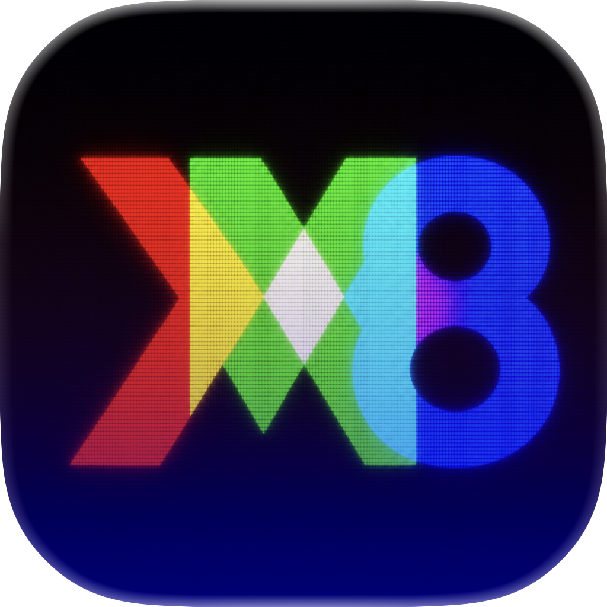

# XM8M

<p align="center">
  
</p>

[English](README.en.md)

NEC PC-8801のエミュレーターです。マルチプラットフォームです。


<p align="center">
  <a href="https://github.com/bubio/xm8m/releases/latest">
    
  </a>
  <a href="https://github.com/bubio/xm8m/blob/main/LICENSE">
    
  </a>
  <a href="https://github.com/bubio/xm8m/actions/workflows/Windows_x86_x64_arm64.yml">
    
  </a>
  <a href="https://github.com/bubio/xm8m/actions/workflows/macOS_Universal.yml">
    
  </a>
  <a href="https://github.com/bubio/xm8m/actions/workflows/Linux_x86_64.yml">
    
  </a>
  <a href="https://github.com/bubio/xm8m/actions/workflows/Linux_x86_64_AppImage.yml">
    
  </a>
  <a href="https://github.com/bubio/xm8m/actions/workflows/Linux_arm64.yml">
    
  </a>
  <a href="https://github.com/bubio/xm8m/actions/workflows/Linux_arm64_AppImage.yml">
    
  </a>
  <a href="https://github.com/bubio/xm8m/actions/workflows/RaspberryPiOS_armhf.yml">
    
  </a>
  <a href="https://github.com/bubio/xm8m/actions/workflows/Android.yml">
    
  </a>
  <a href="https://github.com/bubio/xm8m/releases/latest">
    
  </a>
</p>

## XM8Mとは
---
XM8Mは、ＰＩ．さんが開発したXM8をベースにした、PC-8801MA（PC-8801mkIISR上位互換）のマルチプラットフォームエミュレータです。旧名称はxm8macです。

<p align="center">
  
</p>

このリポジトリは ＰＩ．さんから許可をいただき作成しています。

公式では配布されていないmacOS版の開発を主に行なっていきますが、Windows/Linux/Android版もできる限り配布します。

<br />

公式はこちらです。

http://retropc.net/pi/xm8/index.html


<br />

## インストール方法
---

[リリース](https://github.com/bubio/xm8m/releases)からお手持ちの環境にあった実行ファイルをダウンロードしてください。

`XM8.app`を`アプリケーション`フォルダに移動するなどして実行してください。

<br />

### 動作環境

| プラットフォーム | CPU | 最小OSバージョン | 実行ファイル |
| --- | --- | --- | --- |
| macOS | x86_64 | macOS 10.13 High Sierra | [Universal版](https://github.com/bubio/xm8m/releases/latest/download/XM8_macOS_Universal.dmg) |
| macOS | Apple Silicon | macOS 11 Big Sur | [Universal版](https://github.com/bubio/xm8m/releases/latest/download/XM8_macOS_Universal.dmg) |
| Windows | x86_64 / x86_32 / ARM64 | Windows 10 | [x86_64版](https://github.com/bubio/xm8m/releases/latest/download/XM8_Windows_x86_64.zip) / [x86_32版](https://github.com/bubio/xm8m/releases/latest/download/XM8_Windows_x86_32.zip) / [ARM64版](https://github.com/bubio/xm8m/releases/latest/download/XM8_Windows_ARM64.zip) |
| Linux | x86_64 / arm64 | Ubuntu 22.04以降（.deb） / Fedora 36以降（.rpm） | [x86_64版](https://github.com/bubio/xm8m/releases/latest/download/XM8_Linux_x86_64.deb) / [arm64版](https://github.com/bubio/xm8m/releases/latest/download/XM8_Linux_arm64.deb) |
| Raspberry Pi OS | armhf | Bookworm以降 | [armhf版](https://github.com/bubio/xm8m/releases/latest/download/XM8_Linux_armhf.deb) |
| Android | arm64-v8a / armeabi-v7a / x86_64 | Android 4.4（API 19）以降 | [APK](https://github.com/bubio/xm8m/releases/latest/download/XM8_Android.apk) |

<br />

Linux版は、各ディストリビューション用の依存ライブラリをパッケージマネージャーで導入してください。Android版のRetroAchievements機能はAndroid 6.0（API 23）以降で利用できます。

<br />

## ROMファイル
---
使用できるROMファイルについては、[README-XM8.txt](Documents/README-XM8.txt)の[ROMファイル]を参照してください。

<br />

### 配置場所
ROMファイルの配置場所は、設定ファイルと同じ以下になります（一度、アプリケーションを起動するとフォルダが作成されます）。


```shell
"~/Library/Application Support/retro_pc_pi/xm8"
```


<br />

## 使用方法
---
[README-XM8.txt](Documents/README-XM8.txt)の[使い方]を参照してください。

### コマンドライン起動

Windows、macOS、Linux では、最大2個の D88 イメージをコマンドラインで指定できます。指定順にドライブ1、ドライブ2へ挿入されます。プレイリストは`.m3u`と`.m3u8`に対応しています。

```shell
xm8 [options] [--] [disk-spec ...]

xm8 game.d88
xm8 game.d88#1
xm8 system.d88#0 data.d88#1
xm8 game.m3u
xm8 game.m3u8
xm8 --system V1H --clock 4MHz game.d88
```

`disk-spec` は `<path>`、`<path>#<bank>`、`<path>:<bank>` のいずれかです。bank は0始まりです。

オプション:

```text
--system <V1S|V1H|V2|N>
--clock <4|4MHz|8|8MHz|8H|8MHzH>
-h, --help
--version
```

`--system` と `--clock` はその起動中だけ有効で、通常の設定や自動保存 state には残りません。ファイル名の最後の要素に `#` または `:` を含むパスは bank 指定と曖昧になるため、コマンドラインでは指定できません。

### RetroAchievements

RetroAchievements対応を含むbuildでは、メインメニューの`RetroAchievements`からログインとRAモードの切り替えができます。対応ゲームの実績、リーダーボード、Rich Presence、Hardcoreモードを利用できます。

RetroAchievementsのHardcore操作制限は、
[公式Hardcore準拠要件](https://docs.retroachievements.org/general/hardcore-compliance-requirements.html)と
`Documents/RetroAchievements/41_Hardcore完全準拠開発計画.md`を規範とします。番号の小さい計画書や
実施記録に過去の記述が残る場合は、現行の規範資料を優先します。Hardcore中のデバッグ用Saveは
許可し、Load、通常／automatic state、Full Speedは禁止します。

XM8Mは完全無料・非商用で、広告、アプリ内課金、課金版、機能差のある寄付特典はありません。

RAモードでは、選択したD88をライブラリへ登録し、原本を変更しないアプリ専用の作業コピーを使用します。認証やネットワーク接続に失敗した場合でもゲームは起動できますが、そのセッションでは実績の評価・送信は行われません。

Android版はAPI 19以上で起動しますが、RetroAchievementsのUI・通信・資格情報保存はAndroid 6.0（API 23）以上でのみ有効です。

[プライバシーポリシー](PRIVACY.ja.md) / [English privacy policy](PRIVACY.md) / [ライセンス一覧](LICENSES.md)


<br />

## ビルド方法
---

### ビルド環境

ビルドするには以下のインストールが必要です。

- Xcode

  使うのはコマンドラインツールだけですが、Xcodeをインストールしてしまうのが手っ取り早いと思います。

- Homebrew
  
  [Homebrew](https://brew.sh/)のインストールが必要です。
  cmakeなどビルドに必要なツールの取得に使用します。

<br />

### ビルド手順

プロジェクトのルートをターミナルで開き、以下のコマンドを実行します。

```shell
cd Builder/macOS
./dist_app.sh
```

これでbuildフォルダに実行ファイル(.app)が作成されているはずです。

<br />

## 謝辞
---
ソースコードの改変を快諾してくださったＰＩ．氏にお礼申し上げます。


<br />

## その他のOS

---

### Windows版

----

Builder/WindowsフォルダにVisual Studio 2022用のソリューションが入っています。

<br />

Builder/Windowsフォルダにあるsetup_sdl2.ps1を実行すると、ビルドに必要なSDL2をダウンロードして適切な場所に配置します。

<br />

以下のようになります。

- Builder\Windows\SDL\include（インクルードファイル）
- Builder\Windows\SDL\lib\x86（x86向けライブラリ）
- Builder\Windows\SDL\lib\x64（x64向けライブラリ）
- Builder\Windows\SDL\lib\arm64（arm64向けライブラリ）

<br />

Builder/Windows/XM8.sln をVisual Studioでビルドします。
Builder/Windows/x64、Builder/Windows/Win32、Builder/Windows/ARM64に出力されます。実行に必要なのは、XM8.exeとSDL2.dllです。

RetroAchievements対応は通常のWindows配布buildで有効になります。機能を完全に除外した
互換確認用buildが必要な場合は、Developer PowerShellから共通property
`XM8_ENABLE_RETROACHIEVEMENTS=false`を指定できます。

```powershell
msbuild Builder\Windows\XM8.sln /m /p:Configuration=Release /p:Platform=x64 /p:XM8_ENABLE_RETROACHIEVEMENTS=true
msbuild Builder\Windows\XM8.sln /m /p:Configuration=Release /p:Platform=x64 /p:XM8_ENABLE_RETROACHIEVEMENTS=false
```

RA有効buildでは、`THIRD_PARTY_NOTICES.md`と`Licenses` directoryも出力先へコピーされます。
Win32、x64、ARM64のDebug／Releaseで同じpropertyを利用できます。

BIOS ROMファイルの置き場所は以下になります。

```shell
%appdata%\retro_pc_pi\xm8
```


### Linux版

----

Builder/Linuxフォルダにdeb, rpm, appimageパッケージを作成するスクリプトが入っています。

ビルドに必要なライブラリは、dist_app.shを参照してください。

### deb or rpm
```shell
cd Builder/Linux
./dist_app.sh
```
これでbuildフォルダにdebファイル、またはrpmファイルが作成されます。

<br />

### appimage
```shell
cd Builder/Linux
./appimage.sh
```
これでBuilder/Linuxフォルダに、appimageファイルが作成されます。

<br />

### Flatpak（RetroAchievements 有効版）

Flatpak パッケージは x86_64 と arm64 の両方を同じ manifest からネイティブにビルドします。ビルドには Freedesktop 25.08 runtime が必要です。

```shell
flatpak install flathub org.freedesktop.Sdk//25.08 org.freedesktop.Platform//25.08
flatpak-builder --user --install --force-clean flatpak-build com.github.bubio.xm8m.yml
```

RA の通信と認証情報の保存、SDL による ROM／ディスクイメージ選択のため、ネットワーク、Secret Service、およびホームディレクトリへのアクセスを許可します。BIOS ROM は Flatpak の設定ディレクトリに配置してください。

```shell
~/.var/app/com.github.bubio.xm8m/data/retro_pc_pi/xm8/
```

<br />

BIOS ROMファイルの置き場所は以下になります。

```shell
~/.local/share/retro_pc_pi/xm8/
```


### Android版

----

Builder/AndroidフォルダにAndroid Studio用のプロジェクトが入っています。

<br />

Builder/Androidフォルダにあるsetup_sdl2.shを実行すると、ビルドに必要なSDL2をダウンロードして適切な場所に配置します。

<br />

以下のようになります。

- Builder/Android/app/jni/SDL\include（インクルードファイル）
- Builder/Android/app/jni/SDL\src（ソースファイル）
- Builder/Android/app/src/java/org/libsdl/app（Javaソースファイル）

<br />

Builder/AndroidをAndroid Studioで開いてビルドします。

<br />

BIOS ROMファイルの置き場所は以下になります。

```shell
Android/data/retro_pc_pi/files/
```

Android 11以上の場合、端末内のファイルに自由にアクセスすることができません。

ゲームのディスクイメージも同じ場所に入れることを推奨します。


## 使用しているOSSのライセンス

| Component | Version | License |
| --- | --- | --- |
| [xBRZ](https://sourceforge.net/projects/xbrz/) | bundled | GPLv3 |
| [rcheevos](https://github.com/RetroAchievements/rcheevos) | 12.3.0 | MIT |
| [SQLite](https://www.sqlite.org/) | 3.53.0 | Public Domain |
| [stb_image](https://github.com/nothings/stb) | 2.30 | MIT OR Public Domain |

rcheevos、SQLite、stb_imageはRetroAchievements対応buildで使用します。依存関係の
バージョン、来歴、ライセンス本文は[ThirdParty/README.md](ThirdParty/README.md)、
[ThirdParty/THIRD_PARTY_NOTICES.md](ThirdParty/THIRD_PARTY_NOTICES.md)、
`ThirdParty/licenses/`を参照してください。
